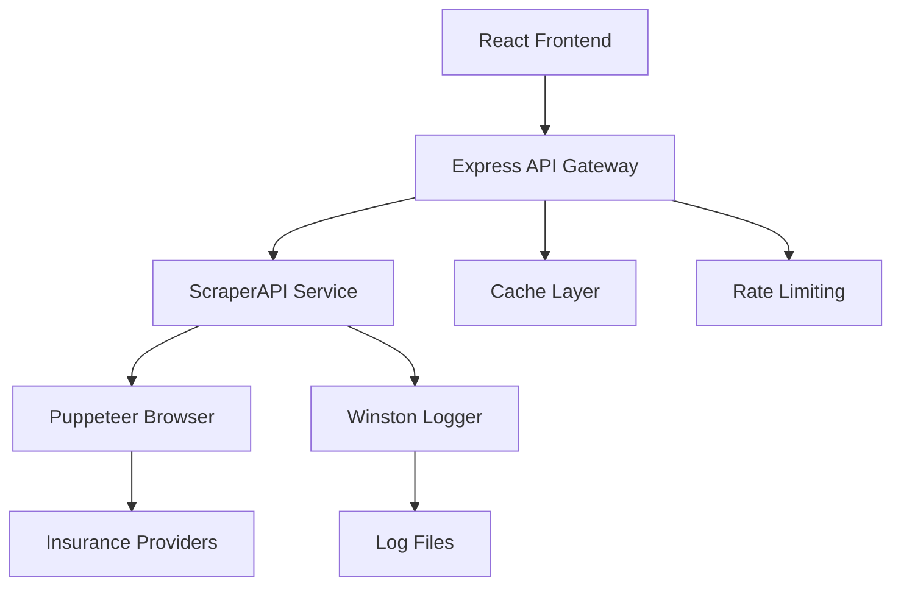

# SundayInsurance: AI-Powered Vehicle Insurance Platform

<div align="center">


**A comprehensive insurance comparison platform with intelligent web scraping capabilities**

[](https://www.typescriptlang.org/)
[](https://reactjs.org/)
[](https://nodejs.org/)
[](https://expressjs.com/)
[](https://pptr.dev/)

[Demo](#demo) • [Features](#features) • [Installation](#installation) • [API Documentation](#api-documentation) • [Contributing](#contributing)

</div>

## 📋 Table of Contents

- [Overview](#overview)
- [Architecture](#architecture)
- [Features](#features)
- [Tech Stack](#tech-stack)
- [Getting Started](#getting-started)
- [Project Structure](#project-structure)
- [API Documentation](#api-documentation)
- [Frontend Usage](#frontend-usage)
- [ScraperAPI Usage](#scraperapi-usage)
- [Configuration](#configuration)
- [Testing](#testing)
- [Deployment](#deployment)
- [Contributing](#contributing)
- [License](#license)

## 🔍 Overview

SundayInsurance is a modern, AI-powered vehicle insurance comparison platform that combines a sleek React frontend with a robust web scraping backend. The platform enables users to compare insurance quotes from multiple providers through an intuitive interface while leveraging automated data collection capabilities.

### Key Components

- **Frontend**: Modern React application with TypeScript, Tailwind CSS, and Radix UI
- **ScraperAPI**: Node.js/Express backend with Puppeteer-based web scraping capabilities
- **AI Integration**: Intelligent quote analysis and recommendations
- **Real-time Data**: Live insurance quote comparison from multiple providers

## 🏗️ Architecture



## ✨ Features

### 🎯 Core Features
- **Multi-step Vehicle Selection**: Brand → Model → Fuel Type → Variant → Registration Place
- **Real-time Quote Comparison**: Live data from multiple insurance providers
- **AI-Powered Recommendations**: Intelligent analysis of insurance options
- **Responsive Design**: Modern UI that works on all devices
- **Fast Performance**: Optimized with Vite build system and caching

### 🤖 ScraperAPI Features
- **Intelligent Web Scraping**: Automated data collection from insurance websites
- **Session Management**: Persistent browser sessions for complex workflows
- **Rate Limiting**: Built-in protection against API abuse
- **Comprehensive Logging**: Detailed logging with Winston
- **Error Handling**: Robust error management and recovery
- **Caching System**: Redis-like caching for improved performance

### 🛡️ Security & Performance
- **Input Validation**: Joi-based request validation
- **CORS Protection**: Configurable cross-origin resource sharing
- **Helmet Integration**: Security headers and protection
- **Memory Management**: Efficient browser instance management
- **Request Throttling**: Configurable rate limiting

## 🛠️ Tech Stack

### Frontend
- **Framework**: React 18 with TypeScript
- **Build Tool**: Vite
- **Styling**: Tailwind CSS
- **UI Components**: Radix UI primitives
- **Forms**: React Hook Form with Zod validation
- **HTTP Client**: Axios
- **State Management**: React Context/Hooks

### Backend (ScraperAPI)
- **Runtime**: Node.js
- **Framework**: Express.js
- **Language**: TypeScript
- **Web Scraping**: Puppeteer
- **Logging**: Winston
- **Validation**: Joi
- **Caching**: Node-cache
- **Testing**: Jest
- **Security**: Helmet, CORS, Rate Limiting

## 🚀 Getting Started

### Prerequisites

```bash
Node.js >= 18.0.0
npm >= 8.0.0
Git
```

### Installation

1. **Clone the repository**
```bash
git clone https://github.com/devangk003/SundayInsurance.git
cd SundayInsurance
```

2. **Install Frontend Dependencies**
```bash
cd frontend
npm install
```

3. **Install ScraperAPI Dependencies**
```bash
cd ../ScraperAPI
npm install
```

4. **Environment Configuration**
```bash
# In ScraperAPI directory
cp .env.example .env
# Edit .env with your configuration
```

### Quick Start

#### Option 1: Run Both Services
```bash
# Terminal 1 - Start ScraperAPI
cd ScraperAPI
npm run dev

# Terminal 2 - Start Frontend
cd frontend
npm run dev
```

#### Option 2: Production Build
```bash
# Build Frontend
cd frontend
npm run build

# Build and Start ScraperAPI
cd ../ScraperAPI
npm run build
npm start
```

## 📁 Project Structure

```
SundayInsurance/
├── frontend/                   # React frontend application
│   ├── public/                # Static assets
│   ├── src/
│   │   ├── components/        # Reusable UI components
│   │   ├── pages/             # Page components
│   │   ├── hooks/             # Custom React hooks
│   │   ├── services/          # API service layer
│   │   └── lib/               # Utility functions
│   ├── package.json
│   └── vite.config.ts
│
├── ScraperAPI/                # Backend scraping service
│   ├── src/
│   │   ├── api/               # Route definitions
│   │   ├── controllers/       # Business logic
│   │   ├── services/          # Core scraping services
│   │   ├── middlewares/       # Express middlewares
│   │   ├── config/            # Configuration files
│   │   ├── types/             # TypeScript type definitions
│   │   └── utils/             # Utility functions
│   ├── RecorderScripts/       # Chrome recorder scripts
│   ├── package.json
│   └── tsconfig.json
│
└── README.md                  # This file
```

## 📚 API Documentation

### Base URL
```
http://localhost:3000/api
```

### Endpoints

#### Health Check
```http
GET /health
```

#### Scrape Insurance Quotes
```http
POST /scrape/quotes
Content-Type: application/json

{
  "vehicleDetails": {
    "brand": "Maruti Suzuki",
    "model": "Swift",
    "variant": "VXI",
    "fuelType": "Petrol",
    "registrationPlace": "Mumbai"
  },
  "userDetails": {
    "name": "John Doe",
    "email": "john@example.com",
    "phone": "9876543210",
    "age": 30
  }
}
```

#### Get Cached Data
```http
GET /data/cached/:key
```

#### Session Management
```http
POST /session/create
GET /session/:sessionId/status
DELETE /session/:sessionId
```

### Response Format
```json
{
  "success": true,
  "data": {
    "quotes": [
      {
        "provider": "Insure24",
        "premium": 15000,
        "coverage": "Comprehensive",
        "features": ["Zero Depreciation", "Engine Protection"]
      }
    ]
  },
  "message": "Quotes fetched successfully",
  "timestamp": "2025-06-01T10:30:00Z"
}
```

## 🎨 Frontend Usage

### Vehicle Selection Flow

```typescript
// Example vehicle selection
const vehicleFlow = {
  step1: 'Select Brand',      // Maruti Suzuki, Hyundai, etc.
  step2: 'Choose Model',      // Swift, i20, etc.
  step3: 'Pick Fuel Type',    // Petrol, Diesel, Electric
  step4: 'Select Variant',    // VXI, SXI, ZXI
  step5: 'Registration'       // State/City
};
```

### Integration Example

```typescript
import { QuoteService } from './services/api';

// Fetch insurance quotes
const quotes = await QuoteService.getQuotes({
  vehicleDetails,
  userDetails
});
```

## 🕷️ ScraperAPI Usage

### Basic Scraping

```typescript
import { ScraperService } from './services/scraperService';

// Initialize scraper
const scraper = new ScraperService();

// Scrape quotes
const quotes = await scraper.scrapeQuotes({
  url: 'https://insurance-provider.com',
  vehicleData: vehicleDetails
});
```

### Session Management

```typescript
// Create persistent session
const session = await SessionService.create({
  provider: 'insure24',
  options: { headless: false }
});

// Use session for multiple operations
await session.navigateAndFill(formData);
const results = await session.extractQuotes();
```

## ⚙️ Configuration

### Environment Variables

#### ScraperAPI (.env)
```env
# Server Configuration
PORT=3000
NODE_ENV=development

# Scraping Configuration
PUPPETEER_HEADLESS=true
PUPPETEER_TIMEOUT=30000
MAX_CONCURRENT_SESSIONS=5

# Rate Limiting
RATE_LIMIT_WINDOW_MS=900000
RATE_LIMIT_MAX_REQUESTS=100

# Logging
LOG_LEVEL=info
LOG_FILE_PATH=./logs/

# Cache Configuration
CACHE_TTL=3600
CACHE_MAX_KEYS=1000
```

#### Frontend (.env)
```env
VITE_API_BASE_URL=http://localhost:3000/api
VITE_APP_TITLE=SundayInsurance
VITE_ENABLE_ANALYTICS=false
```

## 🧪 Testing

### Frontend Tests
```bash
cd frontend
npm run test           # Run tests
npm run test:coverage  # Generate coverage report
```

### ScraperAPI Tests
```bash
cd ScraperAPI
npm test              # Run Jest tests
npm run test:watch    # Watch mode
npm run test:coverage # Coverage report
```

### Test Structure
```
ScraperAPI/tests/
├── unit/              # Unit tests
├── integration/       # Integration tests
├── e2e/              # End-to-end tests
└── fixtures/         # Test data
```

## 🚀 Deployment

### Production Build

```bash
# Build frontend
cd frontend
npm run build

# Build ScraperAPI
cd ../ScraperAPI
npm run build
```

### Docker Deployment

```dockerfile
# Dockerfile example for ScraperAPI
FROM node:18-alpine
WORKDIR /app
COPY package*.json ./
RUN npm ci --only=production
COPY dist ./dist
EXPOSE 3000
CMD ["node", "dist/server.js"]
```

### Cloud Deployment Options

- **Google Cloud Run**: Serverless container deployment
- **AWS ECS**: Container orchestration
- **Heroku**: Platform-as-a-service
- **DigitalOcean**: Droplet-based deployment

## 📊 Performance Monitoring

### Metrics Tracked
- API response times
- Scraping success rates
- Memory usage
- Browser session health
- Cache hit rates

### Logging Levels
```
ERROR: Critical errors requiring immediate attention
WARN:  Warnings that should be monitored
INFO:  General information about operations
DEBUG: Detailed debugging information
```

## 🤝 Contributing

### Development Workflow

1. **Fork the repository**
2. **Create a feature branch**
   ```bash
   git checkout -b feature/amazing-feature
   ```
3. **Make your changes**
4. **Add tests for new functionality**
5. **Ensure all tests pass**
   ```bash
   npm test
   ```
6. **Commit your changes**
   ```bash
   git commit -m "Add amazing feature"
   ```
7. **Push to your branch**
   ```bash
   git push origin feature/amazing-feature
   ```
8. **Open a Pull Request**

### Code Style Guidelines

- **TypeScript**: Strict type checking enabled
- **ESLint**: Consistent code formatting
- **Prettier**: Automated code formatting
- **Conventional Commits**: Standardized commit messages

### Pull Request Checklist

- [ ] Code follows project style guidelines
- [ ] Tests added for new functionality
- [ ] All tests pass
- [ ] Documentation updated
- [ ] PR description clearly explains changes

## 📄 License

This project is licensed under the Apache License 2.0 - see the [LICENSE](LICENSE) file for details.

## 🙏 Acknowledgments

- **Puppeteer Team**: For the excellent web scraping framework
- **React Team**: For the amazing frontend library
- **Radix UI**: For accessible UI components
- **Tailwind CSS**: For utility-first styling

## 📞 Support

For support and questions:

- **GitHub Issues**: [Create an issue](https://github.com/devangk003/SundayInsurance/issues)
- **Email**: devangk003@gmail.com
- **Documentation**: [Wiki](https://github.com/devangk003/SundayInsurance/wiki)

---

<div align="center">

**Built with ❤️ by the SundayInsurance Team**

[⬆ Back to Top](#sundayinsurance-ai-powered-vehicle-insurance-platform)

</div>
